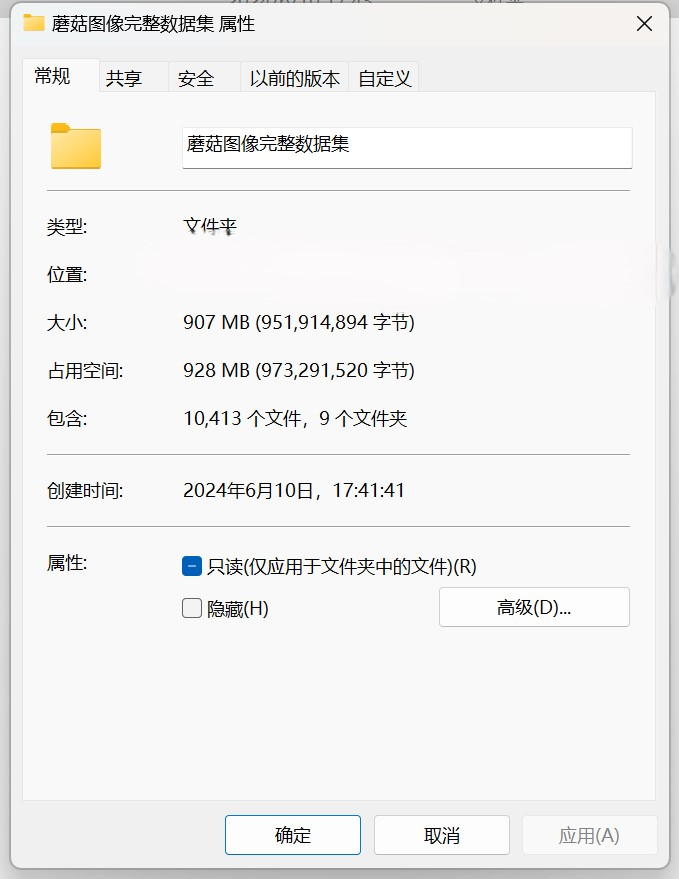
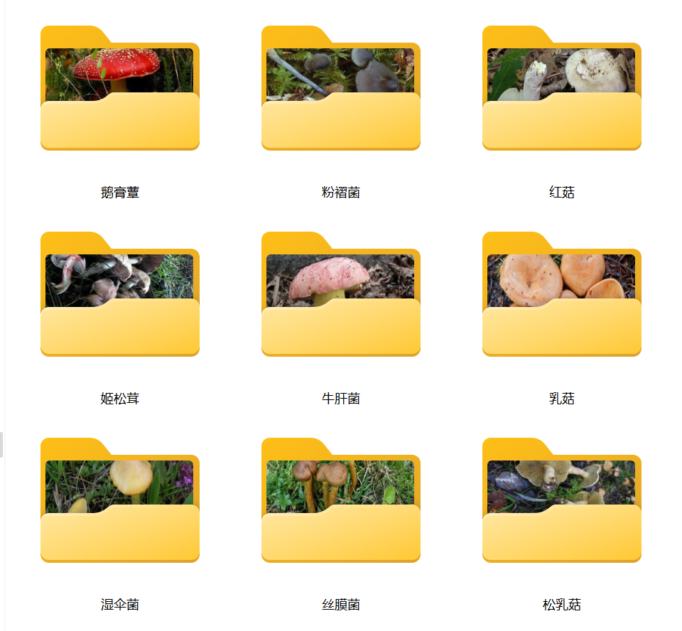

# 9 Species of Mushrooms Classification Dataset

Dataset Information Introduction: In the folder "Silver Mycelium," there are 735 images.
In the folder "Lactiferous Mushrooms," there are 1563 images.
In the folder "Gyroporus," there are 1412 images.
In the folder "Boletus," there are 1072 images.
In the folder "Psathyrella," there are 1264 images.
In the folder "Hygrocybe," there are 1073 images.
In the folder "Pleurotus," there are 1396 images.
In the folder "Agaricus," there are 1148 images.
In the folder "Geastrum," there are 750 images.
The total number of images in all subfolders: 10,413.

Overall Screenshot:
For any questions you have, just ask! I don't need to be friends with you for verification, so you can directly message me. I can see it.
When you search for me, just send your questions at once. I will reply to you, sometimes I am busy, so please describe your problem and intention clearly when I am free.
I will also reply to you when I am free. There is no need for formalities, which makes our communication more efficient.
Your phone number is the same as above. If I forget to reply or you wait impatiently, you can also text message or call.

## Pictures

Here is a pay link on Stripe ( https://buy.stripe.com/3cs8yP7sY87d0vu9AB ). Please contact me lonlonago@foxmail.com after funding $89, and I will send you a complete data files , thank you!

